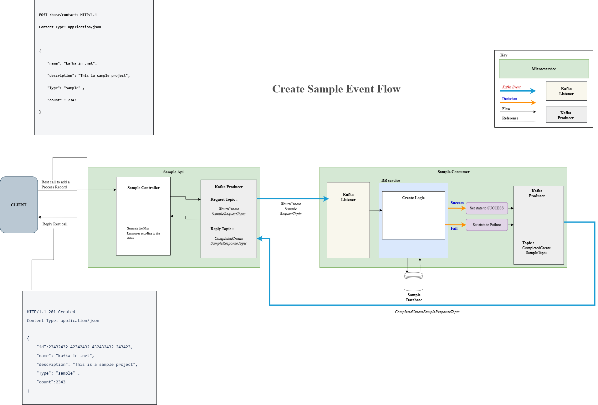

# KafkaCommPatterns

KafkaCommPatterns is a comprehensive .NET 8 project that demonstrates core messaging patterns using Apache Kafka. This project showcases real-world implementation of event-driven architecture with multiple producer-consumer patterns for weekly comparison job processing.

## 🏗️ Architecture Overview

This project implements a microservices-based architecture with the following components:

- **API Layer**: ASP.NET Core Web API that serves as the entry point for job creation requests
- **Common Library**: Shared components including Kafka producers, consumers, and data models
- **Consumer Service**: Background service that processes messages from Kafka topics
- **Event-Driven Communication**: Asynchronous message processing using Apache Kafka

## 📊 Event Flow Diagram

The following diagram illustrates the create request event flow in our system:



## 🚀 Features

### Multiple Producer Patterns
- **Automatic Producer**: Handles automated weekly comparison job creation
- **Clustering Producer**: Manages clustering-based comparison jobs
- **Express Producer**: Processes high-priority express comparison jobs
- **Manual Producer**: Handles manually triggered comparison jobs

### Consumer Patterns
- Event-driven message consumption
- Robust error handling and retry mechanisms
- Scalable message processing architecture

### Technology Stack
- **.NET 8**: Latest version of .NET for modern application development
- **Apache Kafka**: Distributed streaming platform for event-driven architecture
- **Confluent.Kafka**: Official .NET client for Apache Kafka
- **ASP.NET Core**: Web API framework
- **Swagger/OpenAPI**: API documentation and testing

## 📁 Project Structure

```
KafkaCommPatterns/
├── API/                              # Web API project
│   ├── Controllers/                  # API controllers
│   │   └── WeeklyComparisonJobsController.cs
│   ├── DTO/                         # Data transfer objects
│   ├── Services/                    # Application services
│   ├── appsettings.json            # Configuration files
│   └── Program.cs                  # Application entry point
├── COMMON/                          # Shared library
│   ├── Producers/                   # Kafka producer implementations
│   ├── Consumers/                   # Kafka consumer implementations
│   ├── Models/                      # Data models and DTOs
│   └── Configuration/               # Kafka and app configuration
├── CONSUMER/                        # Consumer service project
│   ├── Entities/                    # Domain entities
│   └── Program.cs                  # Consumer application entry point
├── src/                            # Additional source components
│   ├── KafkaCommPatterns.Api/      # API implementation
│   ├── KafkaCommPatterns.Common/   # Common utilities
│   └── KafkaCommPatterns.Consumer/ # Consumer implementation
└── docker/                        # Docker configuration files
```

## 🛠️ Prerequisites

Before running this project, ensure you have the following installed:

- [.NET 8 SDK](https://dotnet.microsoft.com/download/dotnet/8.0)
- [Apache Kafka](https://kafka.apache.org/downloads) (or Docker for containerized setup)
- [Docker](https://www.docker.com/) (optional, for containerized Kafka)

## ⚙️ Configuration

### Kafka Configuration

Update the `appsettings.json` files in both API and Consumer projects with your Kafka broker settings:

```json
{
  "Kafka": {
    "ProducerConfig": {
      "BootstrapServers": "localhost:9092",
      "Acks": "All",
      "Retries": 3
    },
    "ConsumerConfig": {
      "BootstrapServers": "localhost:9092",
      "GroupId": "weekly-comparison-group",
      "AutoOffsetReset": "Earliest"
    },
  }
}
```
## 🚀 Getting Started

### 1. Clone the Repository
```bash
git clone <repository-url>
cd KafkaCommPatterns
```

### 2. Start Kafka (Using Docker)
```bash
# Start Kafka and Zookeeper using Docker Compose
docker-compose up -d
```

### 3. Build the Solution
```bash
# Build the entire solution
dotnet build API.sln
```

### 4. Run the Services

#### Start the API Service
```bash
cd API
dotnet run
```
The API will be available at `https://localhost:7001` (or configured port)

#### Start the Consumer Service
```bash
cd CONSUMER
dotnet run
```

### 5. Test the API
Navigate to `https://localhost:7001/swagger` to access the Swagger UI and test the endpoints.

## 🔌 API Endpoints


## 📨 Message Flow

### Producer Workflow
1. API receives HTTP request for job creation
2. Request is validated and transformed into appropriate message format
3. Message is published to corresponding Kafka topic based on job type
4. Producer confirms message delivery
5. API returns job ID and status to client

### Consumer Workflow
1. Consumer subscribes to relevant Kafka topics
2. Messages are consumed and deserialized
3. Business logic processes the job request
4. Job status is updated in the system
5. Notifications or further events may be triggered

## 🏃‍♂️ Development

### Running Tests
```bash
# Run all tests
dotnet test

# Run tests with coverage
dotnet test --collect:"XPlat Code Coverage"
```

### Code Style
This project follows standard .NET coding conventions. Consider using:
- EditorConfig for consistent formatting
- StyleCop for code analysis
- SonarQube for code quality metrics

## 🐳 Docker Support

### Building Docker Images
```bash
# Build API image
docker build -f API/Dockerfile -t kafkacommpatterns-api .

# Build Consumer image  
docker build -f CONSUMER/Dockerfile -t kafkacommpatterns-consumer .
```

### Docker Compose
```bash
# Start entire stack including Kafka
docker-compose up -d

# View logs
docker-compose logs -f

# Stop services
docker-compose down
```

## 📝 Monitoring and Logging

- **Structured Logging**: Uses built-in .NET logging with structured output
- **Health Checks**: API includes health check endpoints
- **Metrics**: Consider integrating with Prometheus/Grafana for monitoring
- **Kafka Monitoring**: Use Kafka Manager or Confluent Control Center

## 🔧 Troubleshooting

### Common Issues

1. **Kafka Connection Issues**
   - Verify Kafka is running: `docker ps` or check Kafka logs
   - Ensure correct bootstrap servers in configuration
   - Check network connectivity and firewall settings

2. **Message Serialization Errors**
   - Verify message schema compatibility
   - Check Confluent Schema Registry configuration
   - Validate JSON serialization settings

3. **Consumer Lag Issues**
   - Monitor consumer group lag: `kafka-consumer-groups --bootstrap-server localhost:9092 --describe --group weekly-comparison-group`
   - Scale consumer instances if needed
   - Optimize message processing logic

## 🤝 Contributing

1. Fork the repository
2. Create a feature branch (`git checkout -b feature/amazing-feature`)
3. Commit your changes (`git commit -m 'Add amazing feature'`)
4. Push to the branch (`git push origin feature/amazing-feature`)
5. Open a Pull Request

## 📄 License

This project is licensed under the MIT License - see the [LICENSE](LICENSE) file for details.

## 🔗 Related Resources

- [Apache Kafka Documentation](https://kafka.apache.org/documentation/)
- [Confluent .NET Client](https://docs.confluent.io/kafka-clients/dotnet/current/overview.html)
- [.NET 8 Documentation](https://docs.microsoft.com/en-us/dotnet/)
- [Event-Driven Architecture Patterns](https://microservices.io/patterns/data/event-driven-architecture.html)

## 📧 Support

For questions and support, please:
- Check the [Issues](../../issues) section
- Review the [Discussions](../../discussions) for community help
- Consult the troubleshooting section above

---

**Happy Coding!** 🎉